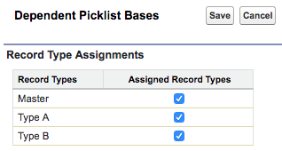

# INTERNAL NOTES

Wait, what is this?

This is meant to be a simple starting point for creating Lightning demo projects

# Structure of the project

* doc - documentation resources
  * images - images for documentation
* data - data used in demo
  * queries - queries used in extracting data for demos
  * trees - data trees used for demos
* dx - salesforce dx project
* mdapi - mdapi version of dx project

# How do I use this?

**If using windows: We're in the middle of migrating to a salesforce cli plugin shortly. Please see the How do I use this manual steps below**

**1.** Download the raw shellscript here:
[https://github.com/SalesforceCloudServices/ltng-support-demo-template/blob/createTemplateProject/createTemplateProject.sh](https://github.com/SalesforceCloudServices/ltng-support-demo-template/blob/createTemplateProject/createTemplateProject.sh)

Place it in a folder that you'll want to store your templates. (The template will be cloned and checked out in the same folder)

**2.** Create a github project within the [SalesforceCloudServices Github](https://github.com/SalesforceCloudServices/)  
with a name similar to: `ltng-support-NAME_OF_DEMO`  
(for example: ltng-support-url-hack)

And copy your new project name.

**(The script will clone the project for you, and populate master for you)**
	
**3.** Run the Shellscript and follow the prompts

	./createTemplateProject.sh
	
	... yadda yadda - remember to make a repo ...
	
	What is the name of the new repository? (ex: ltng-support-url-hack)
	ltng-support-my-project-name
	
	
	The git repository URL is expected to be:
	git@github.com:SalesforceCloudServices/ltng-support-my-project-name.git
	Is this correct? [Y/N]
	y
	
	
	This repository already seems to exist.
	Should we continue? [Y/N]
	y
	
	...
	
	Cloning into 'ltng-support-lds-responsive'...
	
	...
	
	renaming and adding origins
	
	...
	
	pushing project master
	
	...
	
	creating the dx project
	
	...	
	
	-- Your project  has been created
	
	
# How do I use this: Manual Steps

We're in the middle of transitioning from shellscript to a salesforce cli plugin that will accomplish the same as the shellscript.

The manual steps below do the same as the shellscript.

**1.** clone this repository where you will keep your templates:

	git clone git@github.com:SalesforceCloudServices/ltng-support-demo-template.git
	
**2.** import to your demo repo of a similar name: ltng-support-NAME_OF_DEMO

**3.** Create a Salesforce DX project in the 'dx' folder

	//-- newRepositoryName would be the ltng-support-NAME_OF_DEMO
	//-- ex: newRepositoryName="ltng-support-bootstrap"
	sfdx force:project:create --projectname "${newRepositoryName}" -d dx
	
**4.** Rename the org in `dx/config/project-scratch-def.json`
	Change "orgName" value in the JSON to a better name of your scratch org (such as ltng-support-NAME_OF_DEMO)

**5.** Create a scratch org to prepare and store your demo

	// -a [[How you would like to identify the org]]
	// -s [[make the project a default
	// -v [[name of the alias of the lightning support org]]
	// -d [[duration - in days]]
	// -f /path/to/project-scratch-def.json
	
	sfdx force:org:create -d 20 -f dx/config/project-scratch-def.json -s -v [[your hub alias]] -a [[new alias for this scratch org]]
	
	ex:
	
	sfdx force:org:create -d 20 -f dx/config/project-scratch-def.json -s -v lightningSupport -a SOME_ALIAS
	
**6.** CLEANUP: Add `**.profiles` within dx/.forceignore, to ensure we do not track profiles (only permission sets)

# Quick Help:

**How do I create a dx project?**  
[sfdx force:project:create](https://developer.salesforce.com/docs/atlas.en-us.sfdx_cli_reference.meta/sfdx_cli_reference/cli_reference_force_project.htm#cli_reference_force_project)

**How do I run a script after installation?**  
[Create an Apex Class that implements InstallHandler](https://developer.salesforce.com/docs/atlas.en-us.packagingGuide.meta/packagingGuide/apex_post_install_script_create.htm)

**How do I convert the dx source to metadata api (mdapi folder)?**

	sfdx force:source:convert -r force-app -d ../mdapi

**How do I create a package?**

Be careful, you need to specify the --containeroptions/-o as Unlocked when you create it (and this cannot be changed)

--containeroptions/-o Unlocked  
--name/-n Name of the package  
--description/-d Description of the package  
--targetdevhubusername/-v Alias of the Dev Hub  

	ex:
	sfdx force:package2:create -o Unlocked -n ltng-support-url-hack -d "Demos of how to replace URL Hack Buttons in Lightning" -v lightningSupport
	
[See Here for more](https://trailhead.salesforce.com/en/modules/unlocked-packages-for-customers/units/build-your-first-unlocked-package)

**Then update the `sfdx-project.json` file**

Add the following to the `packageDirectories` element in that file:

	{
	  "packageDirectories": [ 
	    {
	      "path": "force-app",
	      "default": true,
	      -- add these items below
	      "id": "0Ho_xxx", -- your package2 ID (not subscriber)
	      "versionName": "Version 1.0",
	      "versionNumber": "1.0.0.NEXT"
	      -- add the items above
	    }
	  ],
	  "namespace": "",
	  "sfdcLoginUrl": "https://login.salesforce.com",
	  "sourceApiVersion": "42.0"
	}
	
**THEN you need to create a package version**

sfdx force:package2:version:create --directory force-app/ --wait 10

**Then** - change the deploy url within the `deploy via url` section down below.

	ex: 
	[https://test.salesforce.com/packaging/installPackage.apexp?p0=YOUR_VERSION_ID](https://test.salesforce.com/packaging/installPackage.apexp?p0=YOUR_VERSION_ID)
	
	and
	(or simply navigate to `https://YOUR_SALESFORCE_INSTANCE/packaging/installPackage.apexp?p0= YOUR_VERSION_ID `  
	if you are already logged in)
	
	turns into
	
	[https://test.salesforce.com/packaging/installPackage.apexp?p0=04t6A000002sreiQAA](https://test.salesforce.com/packaging/installPackage.apexp?p0=04t6A000002sreiQAA)
	
	and
	(or simply navigate to `https://YOUR_SALESFORCE_INSTANCE/packaging/installPackage.apexp?p0= 04t6A000002sreiQAA`  
	if you are already logged in)

**How do I get my password again?**

sfdx force:user:display -u USERNAME

**How do I create a scratch org?**

	// -a [[How you would like to identify the org]]
	// -s [[make the project a default
	// -v [[name of the alias of the lightning support org]]
	// -d [[duration - in days]]
	// -f /path/to/project-scratch-def.json
	
	sfdx force:org:create -v lightningSupport -d 20 -f dx/config/project-scratch-def.json -s -a SOME_ALIAS

# DELETE EVERYTHING ABOVE WHEN READY

-----
-----
------
------
------
------
------

# Overview

Another way that the Lightning Experience is an architectural shift from Salesforce Classic is how Customizations and Standard functionality can communicate with one another securely in the browser.

`(Please note that system to system communications are in a separate example)`

**1.** Standard and Custom Lightning Components can call to one another using Lightning Events.

For more on this case please see the [Communicating between Custom and Standard Components Section below](#communicating-between-custom-and-standard-components).

**2.** Lightning Experience and Visualforce Pages can communicate with one another using PostMessages.

For more on this case, please see the [Communicating with PostMessages section below](#communicating-with-postmessages)

**3.** Lightning Experience can expose Bundled Web Apps (within Static Resources) can communicate via Lightning:Contianer messages.

For more on this case, see the [Communicating with Lightning Containers section below](#communicating-with-lightning-containers)

**4.** Lightning Experience can expose External Web Sites and communicate via Canvas messages.

For more, see the [Communicate with Canvas Apps section below](#communicate-with-canvas-apps)

---

**Please note: sample code (metadata api and dx formats) are available in the [mdapi](./mdapi) and [dx](./dx) folders above**

.

.

# Communicating between Custom and Standard Components

Lightning Experience and the Lightning Component Framework allows Custom and Standard Functionality to work together in ways that were never before possible with Classic.

While there are many options to communicate between components:

* [Bound or Unbound Expressions](https://developer.salesforce.com/docs/atlas.en-us.lightning.meta/lightning/expr_data_binding.htm?search_text=bound)
* [Calling Component Methods](https://developer.salesforce.com/docs/atlas.en-us.lightning.meta/lightning/js_cmp_methods.htm)
* [Lightning Events](https://developer.salesforce.com/docs/atlas.en-us.lightning.meta/lightning/events_intro.htm)
* [Platform Events](https://trailhead.salesforce.com/en/projects/workshop-platform-events/steps/platform-event-subscribe)
* and so on...

... this is not the focus of this Demo.

For more information, please see the [Lightning Inter-Component Communication Patterns](https://developer.salesforce.com/blogs/developer-relations/2017/04/lightning-inter-component-communication-patterns.html) and [An In-Depth Look at Lightning Component Events](https://developer.salesforce.com/blogs/developer-relations/2017/08/depth-look-lightning-component-events.html) blog posts.

(For more on this use case, see [this simplified demo with source code here](https://github.com/SalesforceCloudServices/ltng-support-button-update))

## Lightning Events

Lightning Events can be captured either as **Component Events** or **Application Events**.

**Component Events** are for talking with components that CREATE the component emitting the event (parents/ancestors).

*Please note: this is slightly different from DOM events, as components CREATING the component hear the events, not those that contain the component. Please see [An In-Depth Look at Lightning Component Events](https://developer.salesforce.com/blogs/developer-relations/2017/08/depth-look-lightning-component-events.html) for more information.*

**Application Events** are for broadcasting to all components listening for that type of event (regardless of ancestors).

**Standard Events** are events that are handled by Standard Components and the Lightning Experience to perform standard functionality.

This includes:

<table>
	<tr>
		<th>Event Type</th><th>Description</th>
	</tr>
	<tr>
		<td><a href='https://developer.salesforce.com/docs/component-library/bundle/force:refreshView/specification'>force:refreshView</a></td>
		<td>An event monitored by standard View Lightning Components (such as detail) to refresh</td>
	</tr>
	<tr>
		<td><a href='https://developer.salesforce.com/docs/component-library/bundle/force:showToast/documentation'>force:showToast</a></td>
		<td>Displays page level toast messages (alerts)</td>
	</tr>
	<tr>
		<td><a href='https://developer.salesforce.com/docs/component-library/bundle/force:createRecord/documentation'>force:createRecord</a></td>
		<td>Event fired to show the Full Record Create panel</td>
	</tr>
</table>

For a full list of the types of events supported, please see the [Lightning Component Library - Events](https://developer.salesforce.com/docs/component-library/overview/events).

More detail is available on the [Component Events section of the Lightning Component Developer Guide](https://developer.salesforce.com/docs/atlas.en-us.lightning.meta/lightning/events_component.htm).

---

# Communicating with PostMessages

If using the standard approach for using Visualforce in Lightning Experience Standard Detail pages, there is a possibility of either frequently losing unsaved data or data running out of sync.

But this can be solved using PostMessages, as now Visualforce and Lightning can communicate. (See the [Lightning to Visualforce Using PostMessages section below](#lightning-to-visualforce-using-postmessages))

## Standard Controller loses unsaved changes

The [StandardController.save](https://developer.salesforce.com/docs/atlas.en-us.pages.meta/pages/apex_ApexPages_StandardController_save.htm) - will refresh the entire page - losing all unsaved changes and refreshing all tabs after each save.

!!! - check
[See the Standard Controller Page implementation here](dx/force-app/main/default/pages/ltng_VisualforceStandardController.page)
    
## Custom Actions do not refresh Standard Components

Conversely, if we use Custom Controller Actions, we no longer refresh all tabs (and lose unsaved data), but with the expense of Standard Components not getting refreshed.

This is where we use a custom `save` action, like:
	
	<!-- visualforce -->
	<apex:commandButton action="{!customSave}" value="Save"/>
	
	<!-- apex -->
	public void customSave(){
        update this.record;
        //-- returning a page reference forcing a refresh
        //-- will behave the same as the StandardController.save
   }

This means that the Standard Header and Standard Detail all are showing old values that will only be updated after the page is refreshed - remaining out of sync until then.

!!! - check
[See the custom page implementation](dx/force-app/main/default/pages/ltng_VisualforceWithoutPostMessage.page) and [custom controller implementation](dx/force-app/main/default/classes/ltng_VisualforceWithoutPostMessageCtrl.cls) for more detail.

---

## Lightning to Visualforce Using PostMessages 

Lightning Experience and Visualforce Pages can communicate with one another using [PostMessages](https://developer.mozilla.org/en-US/docs/Web/API/Window/postMessage)

We do this by implementing a [custom Visualforce Component](dx/force-app/main/default/aura/ltng_VisualforceContainer) that can [listen and dispatch PostMessages to the Visualforce page](dx/force-app/main/default/aura/ltng_VisualforceContainer/ltng_VisualforceContainerHelper.js).

Along with [listening for PostMessages on the Visualforce page](dx/force-app/main/default/pages/ltng_VisualforceWithPostMessage.page)

Yet this works in many other situations, such as extending functionality from Managed AppExchange packages (as their code cannot be changed).

* extending functionality from Managed AppExchange packages - like GridBuddy   (as their code cannot be extended)
* pre-loading data from visualforce
* performing data updates with additional parameters.
* and so on.

## PostMessage Syntax

[According to Mozilla Developer Network](https://developer.mozilla.org/en-US/docs/Web/API/Window/postMessage) - the syntax of PostMessage is:
`targetWindow.postMessage(message, targetOrigin, [transfer]);`

`targetWindow`

A reference to the window that will receive the message. Methods for obtaining such a reference include:

* Window.open (to spawn a new window and then reference it),
* Window.opener (to reference the window that spawned this one),
* HTMLIFrameElement.contentWindow (to reference an embedded `<iframe>` from its parent window),
* Window.parent (to reference the parent window from within an embedded `<iframe>`), or
* Window.frames + an index value (named or numeric).

`message`

Data to be sent to the other window. The data is serialized using the structured clone algorithm. This means you can pass a broad variety of data objects safely to the destination window without having to serialize them yourself.

`targetOrigin`

Specifies what the origin of targetWindow must be for the event to be dispatched, either as the literal string "`*`" (indicating no preference) or as a URI.

## PostMessage Example

To displatch a payload to a target window (window.parent), we can call postMessage like so:

	const myPayload = {sender: 'MyVisualforcePage',
		messageType: 'sendToast',
		data: {message: 'Hello'},
	};
	window.parent.postMessage(payload, 'test.my.salesforce.com');

## window.addEventListner syntax
(This is bound to the window to listen for PostMessages submitted)

For more info, please see [the Mozilla Developer Network page on PostMessages](https://developer.mozilla.org/en-US/docs/Web/API/Window/postMessage#The_dispatched_event)

To listen to PostMessages on the parent, we can listen for postMessages like so: (note - we send false, to indicate not to use 'capture' phase). For more info, please see [EventTarget.addEventListner() at MDN](https://developer.mozilla.org/en-US/docs/Web/API/EventTarget/addEventListener)

	function handlePostMessage(event){
		if (event.origin !== 'test.lightning.force.com') {
			//-- failure to check can invite cross site scripting attacks.
			//-- additional security checks
			console.info(`PostMessage.message:${event.data.message}`);
		}
	}

	window.addEventListener("message", handlePostMessage, false);

## PostMessage Helpers

#### [PostMessageEnvelope](mdapi/resources/ltng_PostMessageResources_zip/js/events/PostMessageEnvelope2.js)

PostMessageEnvelope is a JavaScript class that provides a way to send a message from one window to another.

By creating the PostMessageEnvelope2, you can dispatch that event to another window and then receive and parse to have the exact same message dispatched.

It also provides additonal helper functions to specify the page it was sent from, and message type - along with filter functions to validate on the receiving side.

The PostMessageEnvelope is available from any visualforce page by including:

	<apex:includeScript value='{!URLFOR($Resource.ltng_PostMessageResources,"js/events/PostMessageEnvelope2.js")}' />
		
Example dispatch:

	var pageName = 'TestPostMessage';
	var method = 'saveAttempted';
	var isSuccessful = true;
	var data = { userId: 'someId', someSetting: 23 };
	var m = new PostMessageEnvelope( pageName, method, isSuccessful, data );
	
Or all in one line

	new PostMessageEnvelope( 'TestPostMessage','saveComplete',true,{src:window.location.href}).dispatch( parent );
		
To receive events, all that is needed is to listen for 'message' events on the window:

	//-- all postMessages are dispatched as window level events
	//-- of type 'message'
	window.addEventListener( "message", handleResultDispatch, false );
	
	function handleResultDispatch( evt ){
		var postMessage = PostMessageEnvelope.parse( evt );
		
		if( postMessage ){
			postMessage.matchesPageMessage( 'TestPostPage','saveAttempted' )){
			console.log( 'user:' + postMessage.data.userId );
			console.log( 'someSetting:' + postMessage.data.someSetting );
		}
	}

for more info, please see: [https://developer.mozilla.org/en-US/docs/Web/API/Window/PostMessage](https://developer.mozilla.org/en-US/docs/Web/API/Window/PostMessage)

#### PostMessageEnvelope methods

###### constructor( pageName:String, messageType:String, isSuccessful:Boolean, payload:Object|String )

	 Constructs an LNE Post Message (payload).	 
	 @param pageName - String - name of the page
	 @param messageType - String - arbitrary name of the message type to be sent.
	 @param isSuccessful (Boolean) - whether the call was successful or not
	 @param payload (String|Object) - payload to be provided (will be converted to string)

##### dispatch( targetWindow:Window, targetDomain:String = '*' ):void

	 Dispatches the event.
	 @param targetWindow (Window) - target window to dispatch from. i.e. parent
	 @param targetDomain (String) - target domain to accept the request, defaults to '*'
	 @return void
	 
##### parse( evt:PostMessageEvent ):PostMessageEnvelope

	 Parses a dispatched Event)
	 @param evt (string - postMessage Event String)
	 @return boolean - whether it was successful (true) or not (false)

##### PostMessageEnvelope.getMessageOrigin( evt:PostMessageEvent ):String

	 Determines the origin of a PostMessage event.
	 @return String
	 
##### matchesPageMessage( pageName:String, messageType:String ):boolean

	 *  Whether it matches both the page and the message type
	 *  @param pageName (String)
	 *  @param messageType (String)
	 *  @return boolean - whether the pageName and the messageType both match in a case insensitive manner.

#### Sequence Diagram:

[Web Sequence Diagram](https://www.websequencediagrams.com/?lz=dGl0bGUgV2luZG93IFBvc3RNZXNzYWdlCgpQYXJ0aWNpcGFudCBVc2VyAAQNACsGMQABEzIKCgAWByAtPgAgCDogYWRkIGV2ZW50IGxpc3RlbmVyIGZvciBwb3N0IG0AbQZzCgpub3RlIHJpZ2h0IG9mADQJCi8vLS0gYWxsACoFAIEaB3MgYXJlIGRpc3BhdGNoZWQgYXMgdwCBQQZsZXZlbABoBnMANgZvZiB0eXBlICcAZAcnAE0GZm9yIG1vcmUgaW5mbywgcGxlYXNlIHNlZTogaHR0cHM6Ly9kZXZlbG9wZXIubW96aWxsYS5vcmcvZW4tVVMvZG9jcy9XZWIvQVBJLwCCPQYvAIEXCwoAgQkGLmFkZEV2ZW50TACBcgcoICIAgWsHIiwgaGFuZGxlUmVzdWx0RACBRgcsIGZhbHNlICk7CmVuZCBub3RlCgpVc2VyAIJFDUNsaWNrIFRlc3RHcmlkT3ZlcmxheSBhY3Rpb24AgncMKisAgxIIOiAvYXBleC9MTkVfACkPP2FkdmVydGlzZW1lbnRJZD1YWFgAgwgHbGVmAIMDCzI6Ck5vdGljZSB0aGF0IHRoZSBQYXJhbWV0ZXIAgwkKbGF5ZWQgaW4AGwUAggAHCnsAURN9AIFJGTI6IENoYW5nZSAjIG9mIFNwb3RzABATAIIABUJ1dHQAgWwJMgA3DUdldAA1DAAPFENyZWF0ZSBMTkVfAIV0DQCBaBZ2YQCFMAYAhiEHID0gbmV3AC0QKCBwYWdlTmFtZSwAhVYIVHlwZSwgaXNTdWNjZXNzZnVsLCBkYXRhAINYDgCBMhExOgCFWwkAeigAhhoLLgCGGAgoIHBhcmVudABaFACHGw4AhwYHAIUSB3IgcmVjZWl2ZXMgaXQAh0QVAIIoDyBwYXJzAII1CACHOBJmdW4AhRwFAIVjFSgAiBsHKXsKCQCCVRIAgxEPLgBkBQAqCTsKCQCIIQUAgw8Mc2FtZQCIEgVoYXQgd2FzIHNlbnQuCgkuLi4AgWYfcmVzAIh9BXNjcmlwdC4uLg&s=napkin)

.

#### PostMessageOffice

PostMessageOffice is a JavaScript class that provides a very simple way to monitor PostMessages (but mostly geared for managing PostMessageEnvelope2 messages )

To listen for PostMessageEnvelope2 post messages, all that is needed is the following:

**1: Create an instance of the postOffice**

	//-- instantiate with the scope object (to represent 'this' in any handling)
	this.postOffice = new PostMessageOffice(this);
	
**2: Add event listener for any PostMessageEnvelopes based on messageType **

	this.postOffice.addTypeHandler( 'testMessages', function( postMessage ){
		//-- @invariant: an PostMessageEnvelope2 was received and has 'messageType' = 'testMessage';
		//-- @invariant: the EXACT object provided in PostMessageEnvelope2.data is available here
		//-- as postMessage.data
	)

Repeat this for as many messageTypes as you would like to handle.
	
**3: Optional: add handler for any postMessage that the type is not recognized for**

	this.postOffice.addTypeHandler( null, function( postMessage ){
		console.error( 'an unknown postMessage.type was received:' + postMessage.messageType );
	});
	
**4: Listen for postMessages on the window**

	this.postOffice.listenForPostEvents( window );

#### PostMessageOffice methods

###### constructor( scope:Object )

	 Constructs an LNE Message Post Office
	 example: this.postOffice = new PostMessageOffice(this);
	 @param scope - Object - The object that represents 'this' within the handlers.

##### addTypeHandler( messageType:[null|string], handler:function ):void

	 Handler for any PostMessageEnvelope2 post event that has a matching message type. (or catchall handler if null)
	 example: this.postOffice.addTypeHandler( 'testMessage', function(postMessage){} );
	 @param handler (function(PostMessageEnvelope2)) - function that will execute
	 @return void
	 
##### listenForPostevents( window:Window ):void

	 Initiates the PostOffice for listening for PostMessages on that window.
	 example: this.postOffice.listenForPostEvents( window );
	 @param w (Window) window to listen to post messages on.
	 @return void
	 

---

# Communicating with Lightning Containers

Lightning Containers allow an app developed with a third-party framework as a static resource, so it can be hosted and leveraged using [lightning:container components](https://developer.salesforce.com/docs/atlas.en-us.lightning.meta/lightning/container_overview.htm).

This allows standard html/css/javascript apps to be zipped as a static resource, and then communicated with PostMessages using [the provided lightning-container npm module](https://www.npmjs.com/package/lightning-container)

For more information, please see the [Lightning Container section of the Lightning Components Developer Guide](https://developer.salesforce.com/docs/atlas.en-us.lightning.meta/lightning/container_overview.htm)

## Example

In this case, we are using the standard [Bootstrap download](https://getbootstrap.com/docs/4.0/getting-started/download/) with a single change.

Here where [we support decoding the GET parameters and dispatching messages](mdapi/resources/ltng_bootstrap_4_1_0_zip/indexLoad.js)

[See the resulting files here](mdapi/resources/ltng_bootstrap_4_1_0_zip)

## [ltng_BootstrapContainer Component](dx/force-app/main/default/aura/ltng_BootstrapContainer/ltng_BootstrapContainer.cmp)

In the component, the main code is to define the form and the container (using the static resource)

    

        

            <form class="slds-form--inline">
                <lightning:input name="newName" value="{!v.helloName}" label="New Name" />
                <lightning:button label='Send' onclick='{!c.sendMessage}' />
            </form>
        

        <lightning:container aura:id="bootstrapApp"
            src="{!$Resource.ltng_bootstrap_4_1_0 + '/index.html?helloName=' + v.helloName}"
            onmessage="{!c.handleMessage}"
            onerror="{!c.handleError}"
        />
    

## [ltng_BootstrapContainer Controller](dx/force-app/main/default/aura/ltng_BootstrapContainer/ltng_BootstrapContainerController.js)

The controller is meant to be a junction to listen for events and passing to the logic (in the helper)

Here we initialize the component to set the iframe size

	init : function(component, event, helper) {
		//-- do nothing for now.
		var newSize = component.get('v.containerSize');
        helper.setContainerSize(component, helper, newSize);
	},
	
Send a message to the lightning:container.
**Note: for some reason this did not work in the helper and must be here**
    
    /**
     * Sends a message to the bootstrap application
     **/
    sendMessage : function(component, event, helper){
        console.info('sendMessage');
        var helloName = component.get('v.helloName');
        var msg = {
            name: "General",
            value: helloName
        };
        component.find('bootstrapApp').message(msg);
    },
    
And handle the messages sent from the container
    
    /**
     * Handles message sent from bootstrap application
     **/
    handleMessage : function(component, message, helper){
        console.info('lightning received message');
        var payload = message.getParams().payload;
        if (payload.name === "HiBack"){
            var value = payload.value;
            var toastEvent = $A.get("e.force:showToast");
            toastEvent.setParams({
                "title": "Container Says",
                "message": value
            });
            toastEvent.fire();
        } else if (payload.name === "ResizeContainer"){
            console.log('resizeContainer');
            var newSize = payload.value;
            helper.setContainerSize(component, helper, newSize);
        } else {
            console.error('unknown message sent from bootstrap');
        }
    },
    
## [ltng_BootstrapContainer Helper](dx/force-app/main/default/aura/ltng_BootstrapContainer/ltng_BootstrapContainerHelper.js)

In this case, the helper performs the actual logic...

Handle the message from the lightning:container.
(In this case showing a toast message)

    handleMessage : function(name) {
        var toastEvent = $A.get("e.force:showToast");
        toastEvent.setParams({
            "title": "Hi Back",
            "message": name + " says: 'Hi Back'"
        });
        toastEvent.fire();
	},
	
And allowing the container to resize itself after load.
(to ensure the entire page is shown)
    
    setContainerSize : function(component, helper, newSize){
        if (!newSize) newSize = 250;
        var containerSizeCode = "height:" + newSize + 'px';
        component.set('v.containerSize', newSize);
        component.set('v.containerSizeCode', containerSizeCode);
    }

---

# Communicate with Canvas Apps

Lightning Experience can expose External Web Sites and communicate via Canvas messages.

**Please note, [there is a known issue with listening to canvas apps in lightning components](https://salesforce.stackexchange.com/questions/131245/how-to-fire-an-event-from-a-canvas-app-to-a-lightning-component).  So in the meantime, this was implemented using Lightning <-> Visualforce <-> Heroku instead of Lightning <-> Heroku.)**

!!! update once known bug has been corrected.

Similar to the [Lightning to Visualforce Using PostMessages section above](#lightning-to-visualforce-using-postmessages), we use the custom [custom Visualforce Component](dx/force-app/main/default/aura/ltng_VisualforceContainer) that can [listen and dispatch PostMessages to the Visualforce page](dx/force-app/main/default/aura/ltng_VisualforceContainer/ltng_VisualforceContainerHelper.js)

This is only used to allow Visualforce to Communicate with Lightning Experience using Lightning Events, etc.

---

To use the Canvas app, we must create a [Connected App with Canvas Enabled](dx/force-app/main/default/connectedApps/ltng_DemoHerokuNodeJS_CanvasApp.connectedApp-meta.xml)

This will provide the `Consumer Key` and `Consumer Secret` that we will provide to our [External Application (in this case Heroku App)](https://github.com/SalesforceCloudServices/ltng-support-visualforce-to-lightning-canvas#setting-up) to parse the request sent for authentication and authorization.

Here we will specify the [Signed Request](https://developer.salesforce.com/docs/atlas.en-us.platform_connect.meta/platform_connect/canvas_app_signed_req_authentication.htm) authentication.

This means that the request to the External App will include a large set of base64 encoded context and a signed signature.

The signed request information can be verified with the client secret and used to customize the app, and make subsequent calls to Salesforce.

The signed request is a string of the following elements concatenated:
* The canvas app consumer secret encrypted with HMAC SHA–256 algorithm
* A period (“.”)
* The context and authorization token JSON encoded in Base64

The signed request looks similar to this, although it will be much longer: 9Rpl6rE7R2bSNjoSfYdERk8nffmgtKQNhr5U/5eSJPI=.eyJjb250ZXh0Ijp7InVzZXIiOnsibGFuZ3V....

For more information on setting up a Canvas App, please see the [Create Canvas App section below](#create-canvas-app)

## [ltng_visualforceCanvasContainer.page](dx/force-app/main/default/pages/ltng_visualforceCanvasContainer.page)

Within the visualforce page, we need to specify the canvas app by using the Application Name.

Here we will also specify the width and the height of the page,
and any additional context we want to send it (like record ids or even JavaScript objects)

    <apex:canvasApp applicationName="ltng_DemoHerokuNodeJS_CanvasApp"
        namespacePrefix="" onCanvasAppLoad="onCanvasLoad"
        height="800px" width="100%"
        parameters="{}"
    />

Once the canvas loads, it will run the onCanvasLoad javaScript function.

This will register any canvas events we want to listen for,
such as the 'showToast' event

        //-- listen for canvas messages from heroku
        function onCanvasLoad(){
            console.log('onCanvasLoad');
            //-- debugger;

            //-- listen for events sent from the canvas app
            Sfdc.canvas.controller.subscribe({ name: 'showToast', onData: function(evt){
                console.log('event received from canvas: showToast');

                var evtMessage = 'Message from heroku';
                if (evt && evt.message){
                    evtMessage += ':' + evt.message;
                }

                dispatchExampleAuraMessage(evtMessage);
            }});
        }
        
## [External /canvas request verification]()

Within the external App, first we need to review the request to ensure it is authentic (because we are using the [Signed Request authentication](https://developer.salesforce.com/docs/atlas.en-us.platform_connect.meta/platform_connect/canvas_app_signed_req_authentication.htm)).

The majority of the work is done within the [canvasHelpers library - provided](https://github.com/SalesforceCloudServices/ltng-support-visualforce-to-lightning-canvas/blob/master/src/local_modules/CanvasHelpers.js)

[To handle the canvas request](https://github.com/SalesforceCloudServices/ltng-support-visualforce-to-lightning-canvas/blob/master/src/index.js#L20), we call to the canvasHelpers to determine if the signed request matches the known consumerKey and consumerSecret (stored in this case as configuration parameters, but [can be enhanced with additional security if desired](https://devcenter.heroku.com/articles/config-vars)).

[index.js - handleCanvasRequest](https://github.com/SalesforceCloudServices/ltng-support-visualforce-to-lightning-canvas/blob/master/src/index.js#L20)

Note in this case, the most important is checking for the signed request.

Once it is accepted, we can get the Request Context (with the user info, record id, and any other context that was passed)

	/**
	 *  Handles if the callback page is requested
	 *  @param req (request)
	 *  @param resp (response)
	**/
	function handleCanvasRequest(req, resp) {
	  debugger;
	  if (!canvasHelpers.checkForSignedRequest(req, resp)) return;
	  
	  const userInfo = canvasHelpers.getSignedRequestContext(req);
	  
	  const signedRequest = canvasHelpers.getSignedRequest(req);
	  
	  resp.render('pages/canvas', {
	    SIGNED_REQUEST: signedRequest,
	    CLIENT_ID: process.env.CONSUMER_KEY,
	    USERNAME: userInfo.context.user.fullName,
	    INSTANCE_URL: userInfo.client.instanceUrl,
	    TOKEN: userInfo.client.oauthToken,
	    USER_INFO: userInfo,
	  });
	}
	
[canvasHelpers.js - validateSignedRequest](https://github.com/SalesforceCloudServices/ltng-support-visualforce-to-lightning-canvas/blob/master/src/local_modules/CanvasHelpers.js#L50)

	/**
	 *  Checks a signed request
	 *  @param signedRequest (String)
	 *  @param sharedSecret (String)
	 *  @return boolean - true if passing false if not
	**/
	function validateSignedRequest(signedRequest, sharedSecret) {
	  let matches = false;
	  
	  let hashedContext;
	  let b64Hash;
	  let context;
	  let hash;
	  
	  try {
	    //-- hashed context
	    hashedContext = signedRequest.split('.')[0];
	    context = signedRequest.split('.')[1];
	    
	    //-- sign the hash with the secret
	    hash = CryptoJS.HmacSHA256(context, sharedSecret);
	    b64Hash = CryptoJS.enc.Base64.stringify(hash);
	    
	    matches = (hashedContext === b64Hash);
	  } catch (err) {
	    console.error('error occurred while checking signed request');
	    console.error(err);
	  }
	  
	  if (matches) {
	    console.log('signed_request matches');
	  } else {
	    console.error(`signed_request DOES NOT MATCH \
	Expecting:${b64Hash} \
	Found:' + hashedContext`);
	  }
	  
	  return (matches);
	}
	

## [External /canvas page](https://github.com/SalesforceCloudServices/ltng-support-visualforce-to-lightning-canvas/blob/master/src/views/pages/canvas.ejs)

Within the resulting page, we simply need to wait for the canvas to load (using `Sfdc.canvas(handler)` - so we can then listen and dispatch events as needed) 

	Sfdc.canvas( function(){
		var loggedIn = Sfdc.canvas.oauth.loggedin();
		var userClient = <%- JSON.stringify( USER_INFO.client ) %>;
		
		...
		
		toastBtn.onclick = function( evt ){
			console.log( 'toastBtn called' );
			
			//-- get the message to send
			var messageToSend = document.getElementById('messageText').value;
			if (!messageToSend) {
				messageToSend = document.getElementById('messageText').placeholder;
			}
			
			console.info('Heroku Canvas now posting message of type: showToast');
			//-- Sfdc.canvas.client.publish
			Sfdc.canvas.client.publish( userClient, { name:"showToast", payload: { status:"SUCCESS", message:messageToSend }});
		}
	});
	
Note that this uses the userInfo (called userClient here) from the signed request to publish the request back).

## Create Canvas App

We have provided a sample canvas app, but to get the most out of this demo, you should create your own.

**1.** Navigate to Setup (within Lightning Experience), and search for 'App Manager' (or navigate to Apps > App Manager)

**2.** Select 'New Connected App'

**3.** Set the following:

<table>
	<tr>
		<th>Section</th>
		<th>Setting</th>
		<th>Example Value</th>
		<th>Description</th>
	</th>
	<tr>
		<td>Basic Information</td>
		<td>Connected App Name</td>
		<td>Demo Heroku NodeJS Canvas App</td>
		<td>Human readable name for this app</td>
	</tr>
	<tr>
		<td>Basic Information</td>
		<td>API Name</td>
		<td>ltng_DemoHerokuNodeJS_CanvasApp</td>
		<td>The API name for this connected app</td>
	</tr>
	<tr>
		<td>Basic Information</td>
		<td>Contact Email</td>
		<td>[[ Your Email Address ]]</td>
		<td>Email that someone can contact if they have questions</td>
	</tr>
	<tr>
		<td>API</td>
		<td>Enable OAuth Settings</td>
		<td>Checked</td>
		<td>Allows for OAuth to be used</td>
	</tr>
	<tr>
		<td>API</td>
		<td>Callback URL</td>
		<td>https://demo-nodejs-canvas-app.herokuapp.com/callback</td>
		<td>URL for the oauth script to call (but only if not using the signed request form of canvas app - see below)</td>
	</tr>
	<tr>
		<td>API</td>
		<td>Selected OAuth Scopes</td>
		<td>Access Your Basic Information</td>
		<td>The types of requests someone using the canvas app can make. (Should be as restrictive as possible to avoid security concerns)</td>
	</tr>
	<tr>
		<td>Canvas App Settings</td>
		<td>Canvas</td>
		<td>Checked</td>
		<td>Supports Canvas Apps with this connected app</td>
	</tr>
	<tr>
		<td>Canvas App Settings</td>
		<td>Canvas App URL</td>
		<td>https://demo-nodejs-canvas-app.herokuapp.com/canvas</td>
		<td>URL that end user is navigated to when starting the canvas app. (if using signed request, this accepts the signed request - otherwise this is the first page they see post authentication/authoriziation)</td>
	</tr>
	<tr>
		<td>Canvas App Settings</td>
		<td>Access Method</td>
		<td>Signed Request (POST)</td>
		<td>The way the canvas app authenticates/authorizes the request. (We use Signed Request for this demo, but OAuth Webflow can also be used)</td>
	</tr>
	<tr>
		<td>Canvas App Settings</td>
		<td>Locations</td>
		<td>Lightning Component</td>
		<td>Where can this canvas app be called. (Many options available)</td>
	</tr>
</table>

# Install

There are three methods available for you to install this demo, so you can play around with it:

(Please note, all are intended as demonstrations and are not intended for deployment to Production as is)

* [Install via URL](#install-via-url)
* [Install Demo via Salesforce CLI](#install-via-salesforce-cli)
* [Install Demo via Ant/Metadata API](#install-via-metadata-api)

## Install via URL

This works very similar to an App Exchange install.

Please login to an available sandbox and click the link below.

[https://test.salesforce.com/packaging/installPackage.apexp?p0=04t6A000002sreiQAA](https://test.salesforce.com/packaging/installPackage.apexp?p0=04t6A000002sreiQAA)

(or simply navigate to `https://YOUR_SALESFORCE_INSTANCE/packaging/installPackage.apexp?p0= 04t6A000002sreiQAA`  
if you are already logged in)

It is recommended to install for Admins Only (but all options will work)

##### Run Demo Setup

Next, click on the 'dice' and open the 'URL Hack Demo' app.

and run `Setup` from the `URL Hack Demo Setup` tab.

This will then perform any additional setup (such as creating records, etc).

##### Run the Demos

Thats it, all information should be avaiable for running all demos now from the `URL Hack Bases` tab.

Feel free to create your own and to create children through the QuickActions, Lightning Actions or List View buttons.

#### -- Known Issue -- Add the missing permissions on the permission set

If you get an error saying 'This record is not available' (when creating records),
you are likely affectd by a known issue with Unlocked Package deploys.

(This is also mentioned from the Setup page)

We are working with different teams, but it appears as though the installation works correctly from Salesforce CLI, but requires additional steps from the insllation URL.

**We appologize for this inconvenience and are working towards correcting it**

**1.** Navigate to the 'Dependent Picklist Demo' app

**2.** Navigate to the 'Dependent Picklist Demo Setup' page

and click on the link **Add the 'Master', 'Type A' and 'Type B' record types to the permission set'**

This will navigate you to the permission set in your org.

**3.** Click edit and enable the record types for that permission set.

## Installing via the Salesforce CLI

This assumes you have already installed the [Salesforce CLI]() and [Connected the Salesforce CLI to your org](https://developer.salesforce.com/docs/atlas.en-us.sfdx_dev.meta/sfdx_dev/sfdx_dev_auth_web_flow.htm).

However, the Salesforce CLI can be used with any org and does not require Salesforce DX to be enabled. (Although enabling the DX / Dev Hub would give some great benefits, and would only require care of [certain object permissions: Scratch Org Info, ActiveScratchOrg, NamespaceRegistry](https://developer.salesforce.com/docs/atlas.en-us.sfdx_setup.meta/sfdx_setup/sfdx_setup_add_users.htm) - as they are not available in all orgs)

**1.** Run the following command:

	sfdx force:mdapi:deploy -d mdapi -u [[orgAlias]] -w

**2.** Add the permission set to your user

	sfdx force:user:permset:assign -n Ticket_Manager -u [[orgAlias]]
	
**3.** Upload the data

	sfdx force:data:tree:import -f data/tree/Ticket__c.json -u [[orgAlias]]
	
...

Thats it, you can now open the org, and find the 'ticket' object in the 'all tabs' search.

	sfdx force:org:open -u [[orgAlias]]
	
